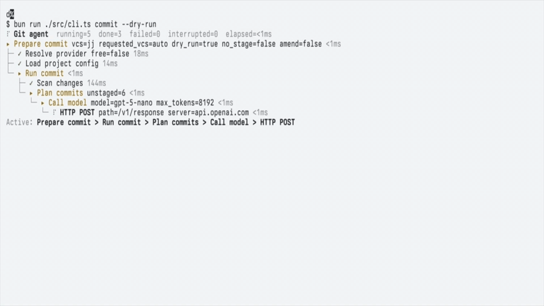

# ai-commit

`ai-commit` is an AI-first commit assistant for Git and Jujutsu (`jj`).
It reads your working tree, plans cleaner atomic commits, and generates commit
messages in a Conventional Commits style.

Chinese quick guide is available in the [中文简版](#中文简版) section below.

`ai-commit` is useful when you want to:

- split a messy set of changes into cleaner commits
- stop writing commit messages by hand
- enforce repository-specific scopes, hooks, and diff limits
- use the same workflow across `git` and `jj`

## Demo



## Install

For most users, `npx` is enough:

```bash
npx @effect-x/ai-commit --help
```

You can also install it globally:

```bash
npm install -g @effect-x/ai-commit
ai-commit --help
```

Prerequisites:

- Node.js 24+
- `git` or `jj`
- an OpenAI-compatible API key

## What It Does

A typical `ai-commit commit` run looks like this:

1. Read the current repository changes.
2. Resolve project rules such as scopes, hooks, and diff limits.
3. Ask the model to plan commit groups.
4. Generate a commit message for each group.
5. Run configured hooks against the generated message.
6. Retry or re-plan when necessary.
7. Create one or more commits.

For `git`, the default behavior includes unstaged and untracked files in the
plan. If you only want already staged changes, use `--no-stage`.

## Quick Start

### 1. Configure your global provider settings

Write your user-level configuration first:

```bash
ai-commit config set api_key sk-xxx
ai-commit config set model gpt-5-nano
ai-commit config set base_url https://api.openai.com/v1
```

Verify the resolved provider config:

```bash
ai-commit config show
```

### 2. Initialize a repository

From your repository root:

```bash
ai-commit init
```

Running `init` with no action flags performs the full setup flow:

- auto-detect `git` vs `jj`
- initialize a repository if the current directory is not one yet
- generate or merge `.gitignore`
- generate project `scopes` from directories and commit history
- write `.ai-commit/config.json`
- enable the built-in `conventional` hook by default

If the current directory is not a repository, the default initialization target
is `git`. If you want `jj` explicitly:

```bash
ai-commit init --vcs jj
```

### 3. Preview before committing

```bash
ai-commit commit --dry-run
```

If the plan looks correct, create the commits:

```bash
ai-commit commit
```

If you want to constrain the planner, provide an intent:

```bash
ai-commit commit --intent "split auth refactor from API cleanup"
```

## Recommended User Flow

For normal day-to-day usage, the most reliable flow is:

1. Configure your API credentials once with `ai-commit config set ...`.
2. Run `ai-commit init` once per repository.
3. Review the generated `.ai-commit/config.json`.
4. Use `ai-commit commit --dry-run` before real commits.
5. Run `ai-commit commit` when the grouping looks right.
6. Use `ai-commit commit --amend` when you need to rewrite the latest commit message.

This produces better results than running the tool with no repository-level
configuration.

## Configuration

### Config file locations

`ai-commit` uses three config layers:

1. User config: `${XDG_CONFIG_HOME:-~/.config}/ai-commit/config.json`
2. Project config: `<repo>/.ai-commit/config.json`
3. Local override config: `<repo>/.ai-commit/config.local.json`

Use them like this:

- user config: API key, model, base URL
- project config: shared repository rules
- local override config: machine-specific or temporary overrides

### Global config

These keys belong in user scope:

- `api_key`
- `base_url`
- `model`

Recommended commands:

```bash
ai-commit config set api_key sk-xxx
ai-commit config set base_url https://api.openai.com/v1
ai-commit config set model gpt-5-nano
```

Example user config:

```json
{
  "api_key": "sk-xxx",
  "base_url": "https://api.openai.com/v1",
  "model": "gpt-5-nano"
}
```

If you do not want to store secrets in the config file, environment variables
also work:

```bash
export OPENAI_API_KEY=sk-xxx
export OPENAI_API_BASE_URL=https://api.openai.com/v1
export OPENAI_MODEL=gpt-5-nano
```

### Project config

Project config lives in `.ai-commit/config.json` and controls repository-level
behavior.

Common fields:

- `scopes`: allowed commit scopes
- `hook`: commit message validation hooks
- `max_diff_lines`: max diff lines sent to the model, where `0` means unlimited
- `no_commit_co_author`: remove the default AI attribution trailer
- `no_model_co_author`: advanced co-author related toggle

Typical example:

```json
{
  "scopes": [
    {
      "name": "api",
      "description": "Backend API handlers"
    },
    {
      "name": "web",
      "description": "Frontend application"
    }
  ],
  "hook": ["conventional"],
  "max_diff_lines": 400
}
```

Common follow-up commands after initialization:

```bash
ai-commit config get hook
ai-commit config set --scope project hook conventional
ai-commit config set --scope project max_diff_lines 400
ai-commit config set --scope local no_commit_co_author true
```

`scopes` are usually better managed by `ai-commit init --scope` or by editing
`.ai-commit/config.json` directly, because the value is an array of objects,
not a simple string list.

### Local override config

Local overrides live in `.ai-commit/config.local.json` and take precedence over
project config.

Use it when you want to:

- disable or swap a hook only on your machine
- avoid committing personal overrides into the repository
- override the shared `max_diff_lines` locally

Examples:

```bash
ai-commit init --local --hook empty
```

```bash
ai-commit config set --scope local hook empty
```

`init --local` cannot run by itself. It must be combined with at least one of:
`--scope`, `--gitignore`, or `--hook`.

## Initializing a Project

### Full initialization

```bash
ai-commit init
```

Use this when onboarding a repository.

### Generate scopes only

```bash
ai-commit init --scope
```

### Generate `.gitignore` only

```bash
ai-commit init --gitignore
```

### Configure a hook only

```bash
ai-commit init --hook conventional
```

### Reinitialize existing config

```bash
ai-commit init --force
```

### Control scope generation depth

```bash
ai-commit init --scope --max-commits 300
```

This controls how much commit history is analyzed when generating scopes.

## Daily Usage

### Preview the commit plan

```bash
ai-commit commit --dry-run
```

This prints the grouped commits without creating them.

### Create commits

```bash
ai-commit commit
```

### Provide a planning intent

```bash
ai-commit commit --intent "only commit the API error handling changes"
```

This becomes the planner's primary constraint and is useful when you want a
narrower or more explicit grouping.

### Commit staged changes only

```bash
ai-commit commit --no-stage
```

This is supported for `git` only. If nothing is staged, the command fails.

### Rewrite the latest commit message

```bash
ai-commit commit --amend
```

### Limit the diff sent to the model

```bash
ai-commit commit --max-diff-lines 500
```

### Remove the default AI trailer

```bash
ai-commit commit --no-attribution
```

### Add co-authors or custom trailers

```bash
ai-commit commit \
  --co-author "Alice <alice@example.com>" \
  --trailer "Reviewed-by: Bob <bob@example.com>"
```

## Hooks

Built-in hook values currently include:

- `conventional`: validate Conventional Commits formatting
- `empty`: do nothing

For a custom shell hook, use `config set`:

```bash
ai-commit config set --scope project hook ./scripts/pre-commit.sh
```

This installs the script into `.ai-commit/hooks/pre-commit` and writes the hook
value into project config.

## Config Precedence

### Provider precedence

For `api_key`, `base_url`, and `model`, resolution is effectively:

1. CLI flags: `--api-key`, `--base-url`, `--model`
2. local Git config: `ai-commit.base-url`, `ai-commit.model`
3. user config file: `~/.config/ai-commit/config.json`
4. environment variables: `OPENAI_API_KEY`, `OPENAI_API_BASE_URL`, `OPENAI_MODEL`
5. defaults: `https://api.openai.com/v1` and `gpt-5-nano`

If you want repository-local model overrides in a Git repository:

```bash
git config --local ai-commit.model gpt-5-nano
git config --local ai-commit.base-url https://api.openai.com/v1
```

### Project precedence

Project-related settings are effectively resolved as:

1. `.ai-commit/config.local.json`
2. `.ai-commit/config.json`
3. user-level fallback for a small subset of fields

In practice, local override config wins over shared project config.

## Notes

- `ai-commit commit` always needs a usable API key.
- `ai-commit init` also needs an API key when running the full setup flow, `--scope`, or `--gitignore`.
- `--no-stage` is supported for `git` only, not `jj`.
- `.ai-commit/config.local.json` is meant for local overrides and usually should not be committed.

## Command Cheatsheet

```bash
ai-commit version
ai-commit config show
ai-commit config get hook
ai-commit init
ai-commit init --scope
ai-commit init --gitignore
ai-commit commit --dry-run
ai-commit commit --intent "split auth fix"
ai-commit commit --amend
```

## 中文简版

`ai-commit` 是一个给 `git` / `jj` 用的 AI 提交工具，会读取当前改动、自动规划更合理的原子提交，并生成 Conventional Commits 风格的提交信息。

推荐流程：

1. 先配置全局 API。
2. 每个项目先执行一次 `ai-commit init`。
3. 日常先跑 `ai-commit commit --dry-run`。
4. 确认结果后再跑 `ai-commit commit`。

### 安装

```bash
npx @effect-x/ai-commit --help
```

### 全局配置

```bash
ai-commit config set api_key sk-xxx
ai-commit config set model gpt-5-nano
ai-commit config set base_url https://api.openai.com/v1
ai-commit config show
```

### 初始化项目

```bash
ai-commit init
```

默认会：

- 自动识别 `git` / `jj`
- 如果当前目录不是仓库则先初始化仓库
- 生成或补全 `.gitignore`
- 生成 `scopes`
- 写入 `.ai-commit/config.json`
- 默认启用 `conventional` hook

### 日常使用

```bash
ai-commit commit --dry-run
ai-commit commit
ai-commit commit --intent "split auth refactor from API cleanup"
ai-commit commit --amend
```

### 配置文件

- 用户配置：`${XDG_CONFIG_HOME:-~/.config}/ai-commit/config.json`
- 项目配置：`<repo>/.ai-commit/config.json`
- 本地覆盖：`<repo>/.ai-commit/config.local.json`

优先级通常是：本地覆盖 > 项目配置 > 用户配置回退。

## Development

If you are working on this repository itself rather than using the published
CLI:

```bash
bun install
bun run check
```

## Acknowledgements

Credit goes to the original author of the Go implementation at
[`GitAgentHQ/git-agent-cli`](https://github.com/GitAgentHQ/git-agent-cli).
This project is an independent TypeScript / Effect port of that work. It is
not affiliated with, maintained by, or endorsed by GitAgentHQ.
